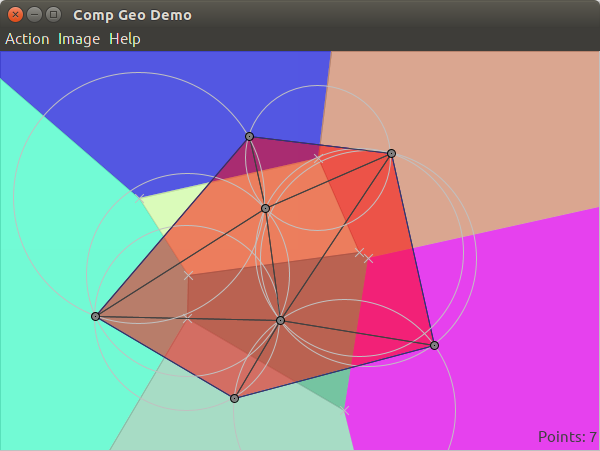

# compgeo
Some cool computational geometry algorithms drawn in a window

### BUILD:
* This requires java, git, and maven to download and build.  On debian linux (including ubuntu), run "sudo apt-get install openjdk-8-jdk git maven" get install the necessary code to compile and run this app.
* Get the code with the command "git clone https://github.com/ants280/compGeo.git" (url is from the "Clone and download" button near the top of this page).
* Run "mvn package" to build the code.  It places a jar file in /target named something like compGeo-VERSION.jar.
* Run "mvn clean" to delete the built code.
### RUN:
* Run the jar file created in the build step or run "mvn package exec:java" from the command line.
### ABOUT:
* https://en.wikipedia.org/wiki/Graham_scan
* https://en.wikipedia.org/wiki/Bezier_curve
* https://en.wikipedia.org/wiki/Voronoi_diagram
* https://en.wikipedia.org/wiki/Delaunay_triangulation

## Screenshot

## License
Project is licensed under the [MIT license](LICENSE).

